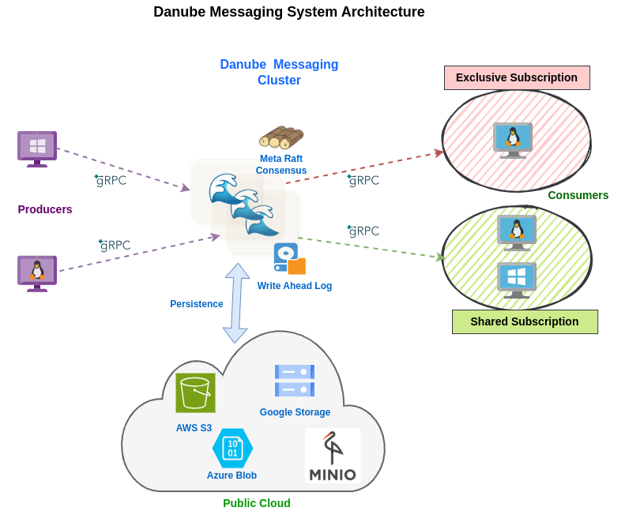

# Danube Messaging Architecture

The Danube messaging system is a distributed messaging system, based on a publish-subscribe model, aiming to provide high throughput and low latency.

The Danube Messaging system's architecture is designed for flexibility and scalability, making it suitable for event-driven and cloud-native applications. Its decoupled and pluggable architecture allows for independent scaling and easy integration of various storage backends. Using the dispatch strategies and the subscription models the system can accommodate different messaging patterns.

### Brokers

Brokers are the core of the Danube Messaging system, responsible for routing and distributing messages, managing client connections and subscriptions, and implementing both reliable and non-reliable dispatch strategies. They act as the main entry point for publishers and subscribers, ensuring efficient and effective message flow.

The Producers and Consumers connect to the Brokers to publish and consume messages, and use the subscription and dispatch mechanisms to accommodate various messaging patterns and reliability requirements.

### Metadata Storage

Each broker embeds a Raft consensus node (powered by [openraft](https://github.com/databendlabs/openraft) with [redb](https://github.com/cberner/redb) for durable log storage). Together the brokers form a replicated state machine that stores cluster metadata: configuration, topic ownership, broker registration, and load-balancing state. Writes go through Raft consensus for strong consistency; reads are served from the local in-memory state machine with zero network hops. No external metadata store is required.

### Storage Layer

The Storage Layer is responsible for message durability and replay. For reliable topics, Danube uses a local Write-Ahead Log (WAL) for the hot path, immutable durable segments for historical replay, and Raft-replicated metadata to map readers and recovering brokers onto the correct history.

The durable storage backend depends on the configured mode:

- `local`
  - local filesystem for both WAL and durable segments
- `shared_fs`
  - local WAL staging plus shared filesystem durable segments
- `object_store`
  - local WAL staging plus remote durable segments via OpenDAL

Readers use tiered access: if data is within local WAL coverage it is served from WAL/cache; otherwise historical data is streamed from durable segments and seamlessly handed off to the WAL tail.

### Non-Reliable Dispatch

Non-Reliable Dispatch operates with zero storage overhead, as messages flow directly from publishers to subscribers without intermediate persistence. This mode delivers maximum performance and lowest latency, making it ideal for scenarios where occasional message loss is acceptable, such as real-time metrics or live streaming data.

### Reliable Dispatch

Reliable Dispatch offers guaranteed message delivery backed by the persistence storage engine:

* **Local WAL** for low-latency appends and fast replay from in-memory cache and WAL files.
* **Durable segments** on local disk, shared filesystem, or object store for recovery, long-range replay, and topic movement.
* **Raft-replicated metadata** tracks segment descriptors, durable frontiers, and sealed topic state for efficient historical reads and correct ownership recovery.

The ability to choose between these dispatch modes gives users the flexibility to optimize their messaging infrastructure based on their specific requirements for performance, reliability, and resource utilization.

For details and mode-specific configuration, see [Persistence Architecture](persistence.md).
