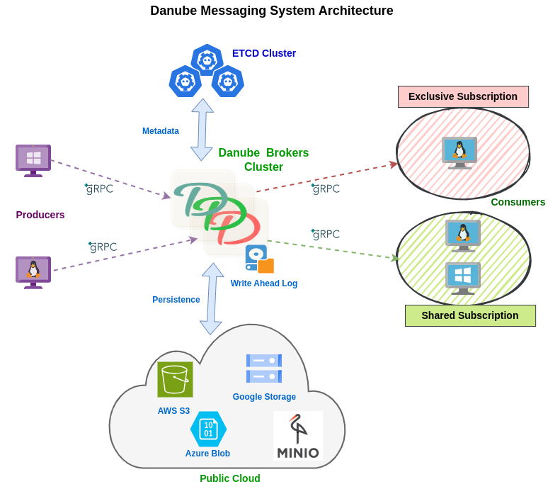

# Danube Messaging Architecture

The Danube messaging system is a distributed messaging system, based on a publish-subscribe model, aiming to provide high throughput and low latency.

The Danube Messaging system's architecture is designed for flexibility and scalability, making it suitable for event-driven and cloud native applications. Its decoupled and plugin architecture allows for independent scaling and easy integration of various storage backends. Using the dispatch strategies and the subscribtion models the system can accomodate different messaging patterns.

### Brokers

Brokers are the core of the Danube Messaging system, responsible for routing and distributing messages, managing client connections and subscriptions, and implementing both reliable and non-reliable dispatch strategies. They act as the main entry point for publishers and subscribers, ensuring efficient and effective message flow.

The Producers and Consumers connect to the Brokers to publish and consume messages, and use the subscription and dispatch mechanisms to accommodate various messaging patterns and reliability requirements.

### Metadata Storage

The ETCD cluster serves as the metadata storage for the system by maintaining configuration data, topic information, and broker coordination and load-balancing, ensuring the entire system operates with high availability and consistent state management across all nodes.

### Storage Layer

The Storage Layer is where the messages are stored. It's a plugable architecture, you can choose to use immediate dispatch so the messages are not persisted and sent to the consumers immediatelly, or you can use reliable dispatch where the messages are persisted and sent to the consumers when they are available.

The Storage Layer introduces flexibility through its pluggable architecture and storing mechanisms including InMemory and Local Disk for simple persistence, or a GRPC storage interface that supports multiple remote backends like S3, GCP Storage, Redis, and TiKV to enhance scalability and durability.

#### Non-Reliable Dispatch

Non-Reliable Dispatch operates with zero storage overhead, as messages flow directly from publishers to subscribers without intermediate persistence. This mode delivers maximum performance and lowest latency, making it ideal for scenarios where occasional message loss is acceptable, such as real-time metrics or live streaming data.

#### Reliable Dispatch

Reliable Dispatch offers guaranteed message delivery using the storage options:

* **InMemory storage** provides quick access and is perfect for development or testing environments; **Local Disk storage** ensures message persistence on the broker's filesystem for enhanced durability.
* **GRPC storage interface** enables connection to external storage systems like AWS S3, GCP Storage, and distributed key-value databases like Redis, TiKV, offering unlimited scalability and enterprise-grade reliability.

The ability to choose between these dispatch modes gives users the flexibility to optimize their messaging infrastructure based on their specific requirements for performance, reliability, and resource utilization.

### Design Considerations

#### Decoupled Architecture

The Danube Messaging system features a decoupled architecture where components are loosely coupled, allowing for independent scaling, easy maintenance and upgrades, and failure isolation.

#### Plugin Architecture

With a plugin architecture, the system supports flexible storage backend options, making it easy to extend and customize according to different use cases. This adaptability ensures that the system can meet diverse application requirements and is cloud-native ready.

#### Event-Driven Focus

Optimized for event-driven systems, the Danube Messaging system supports various message delivery patterns and scalable message processing. Its design is well-suited for microservices, providing efficient and scalable handling of event-driven workloads.

### Danube Platform capabilities matrix

| Dispatch       | Topics            | Subscription | Message Persistence | Ordering Guarantee | Delivery Guarantee |
|----------------|-------------------|--------------|----------------------|--------------------|--------------------|
| **Non-Reliable** |                   |              |                      |                    |                    |
|                | *Non-partitioned Topic*         | *Exclusive*    | No                   | Yes                | At-Most-Once       |
|                |                   | *Shared*       | No                   | No                 | At-Most-Once       |
|                | *Partitioned Topic* | *Exclusive*    | No                   | Per partition      | At-Most-Once       |
|                |                   | *Shared*       | No                   | No                 | At-Most-Once       |
|----------------|-------------------|--------------|----------------------|--------------------|--------------------|
| **Reliable**    |                   |              |                      |                    |                    |
|                | *Non-partitioned Topic*         | *Exclusive*    | Yes                  | Yes                | At-Least-Once      |
|                |                   | *Shared*       | Yes                  | No                 | At-Least-Once      |
|                | *Partitioned Topic* | *Exclusive*    | Yes                  | Per partition      | At-Least-Once      |
|                |                   | *Shared*       | Yes                  | No                 | At-Least-Once      |
