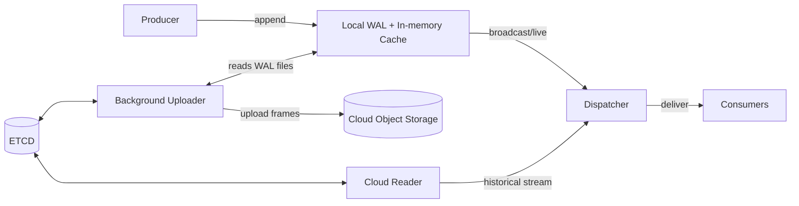

# Danube Persistence Architecture (WAL + Cloud)

Danube's persistence layer has been recently revamped to make the platform cloud‑native, aiming for sub‑second dispatch with cloud economics. 

Danube uses a cloud‑native persistence architecture that combines a local Write‑Ahead Log (WAL) for the hot path with background uploads to cloud object storage. This keeps publish/dispatch latency low while providing durable, elastic, and cost‑effective storage in the cloud.

This page explains the main concepts, how the system works, why it scales in cloud environments, and how to configure it for major providers (S3, GCS, Azure). Danube relies on OpenDAL as a storage abstraction, so it can be plugged into any storage backend.

## Key Benefits

- **Fast hot path**: Producers append to a local WAL and consumers read from memory/WAL; no remote writes on the critical path.
- **Cloud-native durability**: A background uploader persists WAL frames to cloud object storage.
- **Seamless reader experience**: Readers transparently stream historical data from cloud, then live data from WAL.
- **Cost-effective and elastic**: Object storage provides massive scale, lifecycle policies, and low TCO.
- **Portable by design**: Built on OpenDAL, enabling S3, GCS, Azure Blob, local FS, memory, and more.

## High-level Architecture



- **Local WAL**: Append-only log with an in-memory cache for ultra-fast reads. Files periodically fsync and rotate.
- **Background Uploader**: Periodically streams complete WAL frames to cloud objects. Writes object descriptors and sparse indexes to ETCD.
- **Cloud Reader**: Reads historical messages from cloud using ETCD metadata, then hands off to local WAL for live data.
- **ETCD**: Tracks object descriptors, offsets, and indexes for efficient range reads.

## Core Concepts and Components

**WalStorageFactory** creates per-topic `WalStorage`, starts one uploader and one deleter (retention) task per topic, and normalizes each topic to its own WAL directory under the configured root.

**Wal** is an append-only log with an in-memory ordered cache; records are framed as `[u64 offset][u32 len][u32 crc][bytes]` with CRC32 validation, and a background writer batches and fsyncs data, supporting rotation by size and/or time.

**WalStorage** implements the `PersistentStorage` trait; when creating readers it applies tiered logic to serve from WAL if possible, otherwise transparently chains a Cloud→WAL stream to cover historical then live data.

**Uploader** streams safe frame prefixes from WAL files to cloud, finalizes objects atomically, builds sparse offset indexes for efficient seeks, and operates one object per cycle with resumable checkpoints.

**CloudReader** reads objects referenced in ETCD metadata, uses sparse indexes to seek efficiently to the requested range, and validates each frame by CRC during decoding.

**Retention/Deleter** enforces time/size retention on WAL files after they are safely uploaded to cloud, advancing the WAL `start_offset` accordingly.

For persistent storage implementation details, check the [source code](https://github.com/danube-messaging/danube/tree/main/danube-persistent-storage).

## How Reads Work (Cloud→WAL Handoff)

1. A subscription requests a reader at a `StartPosition` (latest or from a specific offset).
2. `WalStorage` checks the WAL’s local `start_offset`.
3. If `start_offset` is older than requested, it:
   Streams historical range from cloud objects via `CloudReader`.
   Seamlessly chains into WAL tail for fresh/live data.
4. Consumers see a single ordered stream with no gaps or duplicates.

## Configuration Overview

Broker configuration is under the `wal_cloud` section of `config/danube_broker.yml`:

```yaml
wal_cloud:
  wal:
    dir: "./danube-data/wal"
    file_name: "wal.log"
    cache_capacity: 1024
    file_sync:
      interval_ms: 5000         # fsync cadence (checkpoint frequency)
      max_batch_bytes: 10485760 # 10 MiB write batch
    rotation:
      max_bytes: 536870912      # 512 MiB WAL file size
      # max_hours: 24           # optional time-based rotation
    retention:
      time_minutes: 2880        # prune locally after 48h
      size_mb: 20480            # or when size exceeds 20 GiB
      check_interval_minutes: 5 # deleter tick interval

  uploader:
    enabled: true
    interval_seconds: 300       # one upload cycle every 5 minutes
    root_prefix: "/danube-data"
    max_object_mb: 1024         # optional cap per object
  
  # Cloud storage backend - MinIO S3 configuration
  cloud:
    backend: "s3"
    root: "s3://danube-messages/cluster-data"  # S3 bucket and prefix
    region: "us-east-1"
    endpoint: "http://minio:9000"     # MinIO endpoint
    access_key: "minioadmin"         # From environment variable
    secret_key: "minioadmin123"     # From environment variable
    anonymous: false
    virtual_host_style: false

  metadata:
    etcd_endpoint: "127.0.0.1:2379"
    in_memory: false
```

- **WAL**: local durability + replay cache for hot reads.
- **Uploader**: cadence and object sizing knobs.
- **Cloud**: provider/backend specific settings (see below).
- **Metadata**: ETCD endpoint used to store object descriptors and indexes.

## Provider Examples (OpenDAL-powered)

Danube uses OpenDAL under the hood. Switch providers by changing `wal_cloud.cloud`.

- **Amazon S3**

```yaml
wal_cloud:
  cloud:
    backend: "s3"
    root: "s3://my-bucket/prefix"
    region: "us-east-1"
    endpoint: "https://s3.us-east-1.amazonaws.com"   # optional
    access_key: "${AWS_ACCESS_KEY_ID}"               # or depend on env/IMDS
    secret_key: "${AWS_SECRET_ACCESS_KEY}"
    profile: null
    role_arn: null
    session_token: null
    anonymous: false
```

- **Google Cloud Storage (GCS)**

```yaml
wal_cloud:
  cloud:
    backend: "gcs"
    root: "gcs://my-bucket/prefix"
    project: "my-gcp-project"
    credentials_json: null                 # inline JSON string
    credentials_path: "/path/to/creds.json" # or path to file
```

- **Azure Blob Storage**

```yaml
wal_cloud:
  cloud:
    backend: "azblob"
    root: "my-container/prefix"                       # container[/prefix]
    endpoint: "https://<account>.blob.core.windows.net" # or Azurite endpoint
    account_name: "<account_name>"
    account_key: "<account_key>"
```

- **In-memory (development)**

```yaml
wal_cloud:
  cloud:
    backend: "memory"
    root: "mem-prefix" # namespace-only; persisted in memory
```

- **Local filesystem**

```yaml
wal_cloud:
  cloud:
    backend: "fs"
    root: "./object_root"   # local directory for persisted objects
```


## Tuning and Best Practices

- **WAL cache size** (`wal.cache_capacity`): increase for higher consumer hit rates; memory-bound.
- **Flush cadence** (`wal.file_sync.interval_ms`): smaller values improve checkpoint freshness but increase fsync pressure.
- **Rotation thresholds** (`wal.rotation.*`): tune file sizes for smoother uploads and operational hygiene.
- **Uploader interval** (`uploader.interval_seconds`): shorter intervals reduce RPO and speed up historical availability in cloud.
- **Object size** (`uploader.max_object_mb`): bigger objects reduce listing overhead; 
- **Retention**: ensure local retention is safely larger than upload interval so deleter never prunes data not yet uploaded.
- **Credentials**: prefer environment-based credentials for cloud providers


## Operational Notes

- **At-least-once delivery**: With reliable topics, dispatch uses the WAL to guarantee at-least-once delivery; cloud persistence is asynchronous and does not block producers/consumers.
- **Resilience**: Uploader uses precise checkpoints `(file_seq, byte_pos)` and never re-uploads confirmed bytes; CloudReader validates CRCs.
- **Observability**: Checkpoints and rotation metadata are stored under the per-topic WAL directory; ETCD keeps object descriptors.
- **Extensibility**: Because Danube uses OpenDAL, adding a new backend typically means adding backend-specific options in config; no broker code changes needed.

