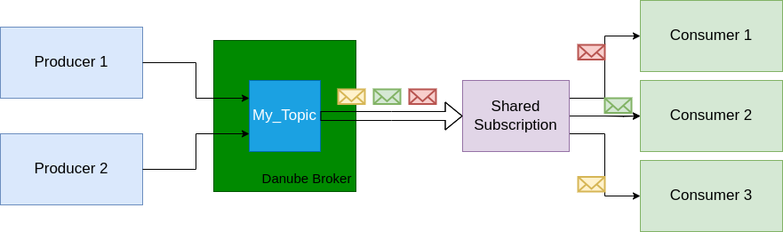

# Subscription

**A Danube subscription** is a named configuration rule that determines how messages are delivered to consumers. It is a lease on a topic established by a group of consumers.

The Danube permits multiple producers and subcribers to the same topic. The Subscription Types can be combined to obtain [message queueing or fan-out](../architecture/Queuing_PubSub_messaging.md) pub-sub messaging patterns.

## Exclusive

The **Exclusive** type is a subscription type that only allows a single consumer to attach to the subscription. If multiple consumers subscribe to a topic using the same subscription, an error occurs.
This consumer has exclusive access to all messages published to the topic or partition.

### Exclusive subscription on Non-Partitioned Topic

* `Consumer`: Only one consumer can be attached to the topic with an Exclusive subscription.
* `Message Handling`: The single consumer handles all messages from the topic, receiving every message published to that topic.

### Exclusive subscription on Partitioned Topic (Multiple Partitions)

* `Consumer`: One consumer is allowed to connect to the subscription across all partitions of the partitioned topic.
* `Message Handling` : This single consumer processes messages from all partitions of the partitioned topic. If a topic is partitioned into multiple partitions, the exclusive consumer handles messages from every partition.

## Shared

The **Shared** subscription type Danube allows multiple consumers to attach to the same subscription. Messages are delivered in a round-robin distribution across consumers, and any given message is delivered to only one consumer.

### Shared subscription on Non-Partitioned Topic

* `Consumers`: Multiple consumers can subscribe to the same topic.
* `Message Handling`: Messages are distributed among all consumers in a round-robin fashion.

### Shared subscription on Partitioned Topic (Multiple Partitions)

* `Consumers`: Multiple consumers can subscribe to the partitioned topic.
* `Message Handling`: Messages are distributed across all partitions, and then among consumers in a round-robin fashion. Each message from any partition is delivered to only one consumer.

## FailOver

The **FailOver** subscription type allows only one consumer (the active consumer) to receive messages at any given time. An active consumer is picked for a non-partitioned topic or for each partition of a partitioned topic and receives messages.

### FailOver subscription on Non-Partitioned Topic

* `Consumers`: Only one active consumer processes messages at a time.
* `Message Handling`: If the active consumer fails, a standby consumer will take over.

### FailOver subscription on  Partitioned Topic (Multiple Partitions)

* `Consumers`: One active consumer processes messages for each partition.
* `Message Handling`: If the active consumer for a partition fails, a standby consumer takes over.

