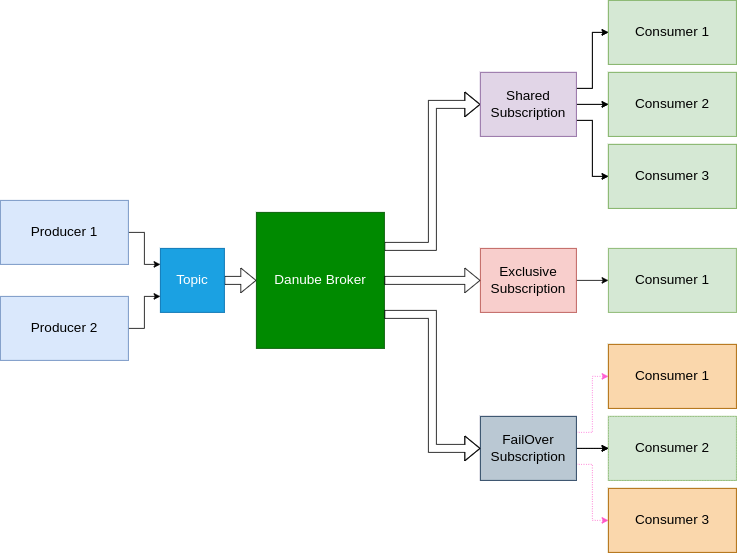
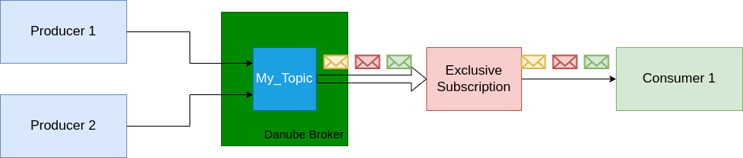
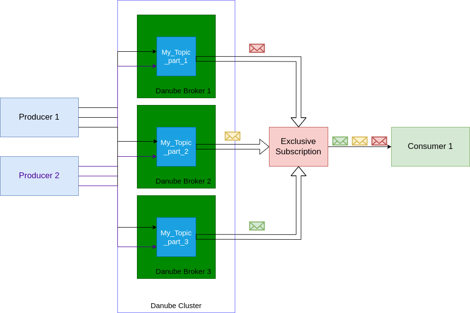
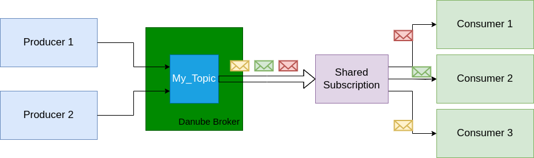
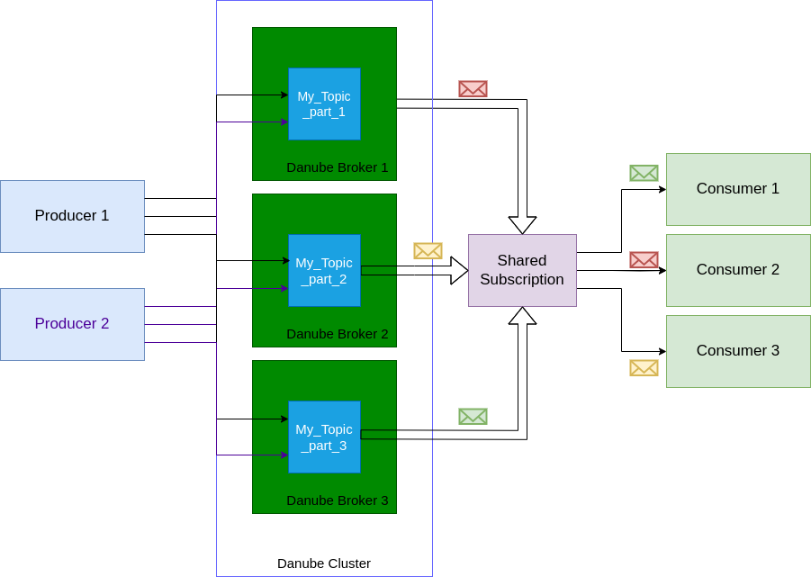
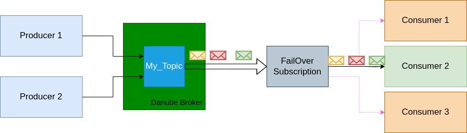
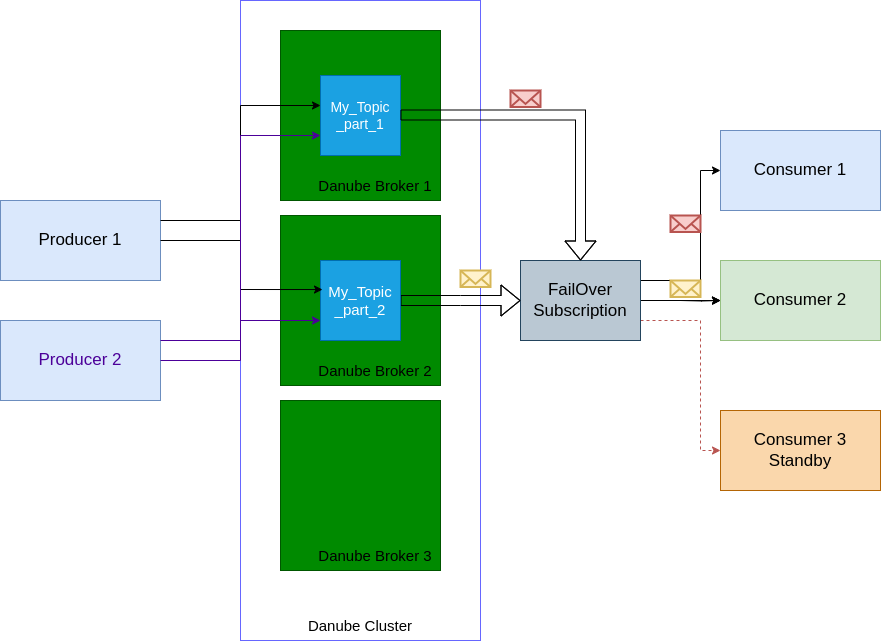

# Subscription

**A Danube subscription** is a named configuration rule that determines how messages are delivered to consumers. It is a lease on a topic established by a group of consumers.

Danube permits multiple producers and subscribers to the same topic. Subscription types can be combined to build queuing (point-to-point) or fan-out (broadcast) messaging patterns — see [examples below](#messaging-patterns). For delivery semantics, see [Dispatch Strategies](dispatch_strategy.md).



## Exclusive

The **Exclusive** type is a subscription type that only allows a single consumer to attach to the subscription. If multiple consumers subscribe to a topic using the same subscription, an error occurs.
This consumer has exclusive access to all messages published to the topic or partition.

### Exclusive subscription on Non-Partitioned Topic

* `Consumer`: Only one consumer can be attached to the topic with an Exclusive subscription.
* `Message Handling`: The single consumer handles all messages from the topic, receiving every message published to that topic.



### Exclusive subscription on Partitioned Topic (Multiple Partitions)

* `Consumer`: One consumer is allowed to connect to the subscription across all partitions of the partitioned topic.
* `Message Handling` : This single consumer processes messages from all partitions of the partitioned topic. If a topic is partitioned into multiple partitions, the exclusive consumer handles messages from every partition.



## Shared

In Danube, the **Shared** subscription type allows multiple consumers to attach to the same subscription. Messages are delivered in a round-robin distribution across consumers, and any given message is delivered to only one consumer.

### Shared subscription on Non-Partitioned Topic

* `Consumers`: Multiple consumers can subscribe to the same topic.
* `Message Handling`: Messages are distributed among all consumers in a round-robin fashion.



### Shared subscription on Partitioned Topic (Multiple Partitions)

* `Consumers`: Multiple consumers can subscribe to the partitioned topic.
* `Message Handling`: Messages are distributed across all partitions, and then among consumers in a round-robin fashion. Each message from any partition is delivered to only one consumer.



## Failover

The **Failover** subscription type allows multiple consumers to attach to the same subscription, with one active consumer at a time. If the active consumer disconnects or becomes unhealthy, another consumer automatically takes over. This preserves ordering and minimizes downtime.

### Failover subscription on Non-Partitioned Topic

* `Consumers`: One active consumer processes all messages; additional consumers are in standby.
* `Message Handling`: If the active consumer fails, a standby consumer takes over and continues from the last acknowledged position.



### Failover subscription on Partitioned Topic (Multiple Partitions)

* `Consumers`: One active consumer per partition; other consumers remain on standby for each partition.
* `Message Handling`: Failover occurs independently per partition, ensuring continuity and ordering within each partition.



## Key-Shared

The **Key-Shared** subscription type allows multiple consumers to attach to the same subscription, where each message is routed to a consumer based on its **routing key**. All messages with the same routing key are guaranteed to be delivered to the same consumer, in order.

This combines the parallelism of Shared subscriptions with per-key ordering guarantees.

### How It Works

* `Key Routing`: Messages are assigned to consumers using consistent hashing on the routing key. Each consumer is allocated virtual nodes on a hash ring, and the routing key determines which consumer owns it.
* `Per-Key Ordering`: At most one message per routing key is in-flight at any time. Additional messages for the same key are queued until the in-flight one is acknowledged.
* `Consumer Elasticity`: When consumers join or leave, only approximately 1/N of existing key assignments are remapped (where N is the number of consumers). The rest remain stable.

### Key Filtering

Consumers can optionally declare **key filter patterns** to receive only specific subsets of messages. Filters use glob syntax:

| Pattern | Matches |
|---------|---------|
| `"payment"` | Exact match only |
| `"ship*"` | `"shipping"`, `"shipment"`, etc. |
| `"eu-west-?"` | `"eu-west-1"`, `"eu-west-2"`, etc. |
| `"*"` | Everything (same as no filter) |

If a consumer has no filters, it accepts all keys. If a message's routing key matches no consumer's filters, the message is skipped by this subscription.

### Producer Usage

Producers tag messages with a routing key using `send_with_key()`:

```rust
// All "payment" messages go to the same consumer
producer.send_with_key(data, None, "payment").await?;
producer.send_with_key(data, None, "shipping").await?;
```

If a message is sent without a routing key (using `send()`), the producer name is used as the fallback key.

### Consumer Usage

```rust
// Automatic key distribution — no filters
let mut consumer = client
    .new_consumer()
    .with_topic("/default/orders")
    .with_consumer_name("worker_1")
    .with_subscription("orders_sub")
    .with_subscription_type(SubType::KeyShared)
    .build()?;

// Explicit key filtering — only receive matching keys
let mut consumer = client
    .new_consumer()
    .with_topic("/default/orders")
    .with_consumer_name("payments_worker")
    .with_subscription("orders_sub")
    .with_subscription_type(SubType::KeyShared)
    .with_key_filter("payment")
    .with_key_filter("invoice")
    .build()?;
```

### Use Cases

* **Order processing**: route all events for the same order ID to one consumer for consistent state management
* **Per-user event streams**: group user activity events by user ID across consumers
* **Multi-tenant workloads**: route tenant data to dedicated consumer instances
* **IoT device routing**: route device telemetry by device ID

For implementation details, see [Key-Shared Dispatch Architecture](../architecture/key_shared_architecture.md).

## Messaging Patterns

Subscription types map directly to common messaging patterns:

### Queuing (Point-to-Point)

One message is delivered to exactly one consumer in a group. Use a **Shared**
subscription with the same name across all workers:

- **Topic**: `/default/orders`
- **Subscription**: `orders-workers` (type `Shared`)
- Run N consumers with the same subscription name. Messages are load-balanced
  round-robin across them.

### Fan-Out (Broadcast)

Every downstream service receives every message. Create a **separate
subscription** per service, typically using `Exclusive` or `Failover` for HA:

- **Topic**: `/default/events`
- **Subscriptions**: `billing` (Exclusive), `analytics` (Exclusive), `monitoring` (Failover)
- Each subscription receives the full event stream independently.

### Key-Affinity Processing

Messages with the same key must be processed by the same consumer for ordering
or state consistency. Use a **Key-Shared** subscription:

- **Topic**: `/default/orders`
- **Subscription**: `order-processors` (type `KeyShared`)
- Run N consumers with the same subscription name. Messages are distributed
  by routing key — all events for the same key go to the same consumer.
- Optionally use key filters to assign specific key patterns to specific consumers.

### Choosing a Dispatch Mode

Both patterns work with either dispatch mode:

- **Non-Reliable** — lowest latency, best-effort delivery, no persistence.
- **Reliable** — at-least-once delivery with WAL + Cloud persistence and replay.

See [Dispatch Strategies](dispatch_strategy.md) for details.

