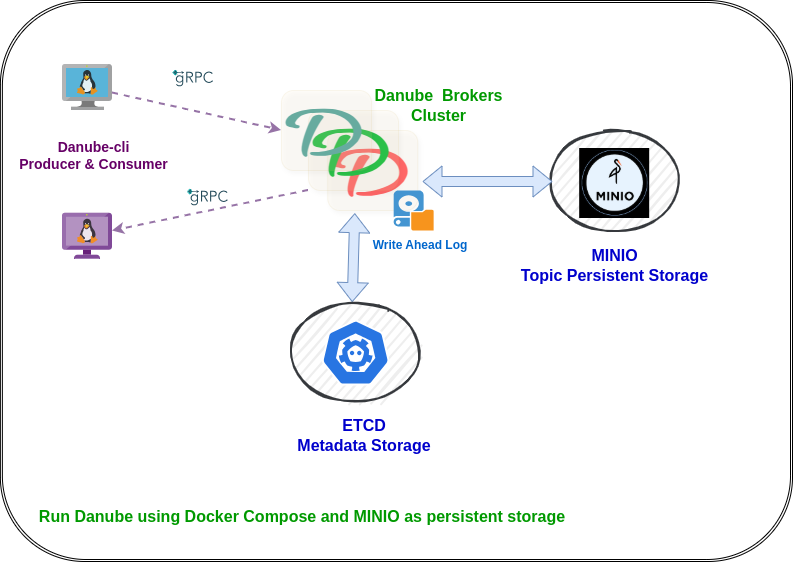

# Run Danube with Docker Compose

This guide provides instructions on how to run Danube Messaging using Docker and Docker Compose. It sets up ETCD for metadata storage and MinIO for topic persistence storage.

## Architecture Overview

The setup includes:
- **2 Danube Brokers**: High-availability message brokers with load balancing
- **ETCD**: Distributed metadata store for cluster coordination
- **MinIO**: S3-compatible object storage for persistent message storage
- **MinIO Client (MC)**: Automatic bucket creation and configuration




## Prerequisites

- Docker Engine 20.10+
- Docker Compose 2.0+
- At least 4GB RAM available for containers
- Ports 2379, 2380, 6650-6651, 9000-9001, 9040-9041, 50051-50052 available

## Quick Start

### Step 1: Setup (Choose One Option)

**Option 1: Download Docker Compose Files (Recommended for running the broker)**

Create a directory and download the required files:

```bash
mkdir danube-docker && cd danube-docker
```

Download the docker-compose file:

```bash
curl -O https://raw.githubusercontent.com/danube-messaging/danube/main/docker/docker-compose.yml
```

Download the broker configuration file:

```bash
curl -O https://raw.githubusercontent.com/danube-messaging/danube/main/docker/danube_broker.yml
```

**Option 2: Clone Repository (Recommended for development and building from source)**

```bash
git clone https://github.com/danube-messaging/danube.git
cd danube/docker
```

### Step 2: Start the Cluster

Start the entire cluster:

```bash
docker-compose up -d
```

### Step 3: Verify all services are healthy

Verify all services are running:

```bash
docker-compose ps
```

Expected output:

```bash
✗ docker-compose ps
NAME        IMAGE        COMMAND       SERVICE         CREATED        STATUS       PORTS

danube-broker1   docker-broker1                             "/usr/local/bin/danu…"   broker1      About a minute ago   Up 6 seconds (health: starting)   0.0.0.0:6650->6650/tcp, [::]:6650->6650/tcp, 0.0.0.0:9040->9040/tcp, [::]:9040->9040/tcp, 0.0.0.0:50051->50051/tcp, [::]:50051->50051/tcp

danube-broker2   docker-broker2                             "/usr/local/bin/danu…"   broker2      About a minute ago   Up 6 seconds (health: starting)   0.0.0.0:6651->6650/tcp, [::]:6651->6650/tcp, 0.0.0.0:9041->9040/tcp, [::]:9041->9040/tcp, 0.0.0.0:50052->50051/tcp, [::]:50052->50051/tcp

danube-cli       docker-danube-cli                          "sleep infinity"         danube-cli   About a minute ago   Up 6 seconds                      

danube-etcd      quay.io/coreos/etcd:v3.5.9                 "/usr/local/bin/etcd"    etcd         About a minute ago   Up 12 seconds (healthy)           0.0.0.0:2379-2380->2379-2380/tcp, [::]:2379-2380->2379-2380/tcp

danube-mc        minio/mc:RELEASE.2024-09-16T17-43-14Z      "/bin/sh -c ' echo '…"   mc           About a minute ago   Up About a minute                 

danube-minio     minio/minio:RELEASE.2025-07-23T15-54-02Z   "/usr/bin/docker-ent…"   minio        About a minute ago   Up About a minute (healthy)       0.0.0.0:9000-9001->9000-9001/tcp, [::]:9000-9001->9000-9001/tcp
```

**Check logs** (optional):
   ```bash
   # View all logs
   docker-compose logs -f
   
   # View specific service logs
   docker-compose logs -f broker1
   docker-compose logs -f broker2
   ```

## Service Endpoints

| Service | Endpoint | Purpose |
|---------|----------|---------|
| Danube Broker 1 | `localhost:6650` | gRPC messaging |
| Danube Broker 2 | `localhost:6651` | gRPC messaging |
| Admin API 1 | `localhost:50051` | Broker administration |
| Admin API 2 | `localhost:50052` | Broker administration |
| Prometheus 1 | `localhost:9040` | Metrics and monitoring |
| Prometheus 2 | `localhost:9041` | Metrics and monitoring |
| MinIO API | `localhost:9000` | S3-compatible storage |
| MinIO Console | `localhost:9001` | Web UI (minioadmin/minioadmin123) |
| ETCD | `localhost:2379` | Metadata store |

## Testing with Danube CLI

### Using the CLI Container

The Docker Compose setup includes a `danube-cli` container with both `danube-cli` and `danube-admin-cli` tools pre-installed. This eliminates the need to build or install Rust locally.

**No local installation required** - use the containerized CLI tools directly.

### Reliable Messaging with S3 Storage

Test the cloud-ready persistent storage capabilities:

**Produce with reliable delivery and S3 persistence:**

```bash
docker exec -it danube-cli danube-cli produce \
  --service-addr http://broker1:6650 \
  --topic "/default/persistent-topic" \
  --count 1000 \
  --message "Persistent message" \
  --reliable
```

**Consume persistent messages:**

```bash
docker exec -it danube-cli danube-cli consume \
  --service-addr http://broker1:6650 \
  --topic "/default/persistent-topic" \
  --subscription "persistent-sub" \
  --sub-type exclusive
```

### Non-Reliable Message Flow Testing

#### Basic string messages

**Produce basic string messages:**

```bash
docker exec -it danube-cli danube-cli produce \
  --service-addr http://broker1:6650 \
  --topic "/default/test-topic" \
  --count 100 \
  --message "Hello from Danube Docker!"
```

**Consume from shared subscription:**

```bash
docker exec -it danube-cli danube-cli consume \
  --service-addr http://broker1:6650 \
  --topic "/default/test-topic" \
  --subscription "shared-sub" \
  --consumer "docker-consumer"
```

#### JSON schema messages

**Produce JSON messages with schema:**

```bash
docker exec -it danube-cli danube-cli produce \
  --service-addr http://broker1:6650 \
  --topic "/default/json-topic" \
  --count 100 \
  --schema json \
  --json-schema '{"type":"object","properties":{"message":{"type":"string"},"timestamp":{"type":"number"}}}' \
  --message '{"message":"Hello JSON","timestamp":1640995200}'
```

**Consume JSON messages:**

```bash
docker exec -it danube-cli danube-cli consume \
  --service-addr http://broker2:6650 \
  --topic "/default/json-topic" \
  --subscription "json-sub" \
  --consumer "json-consumer"
```

### Admin CLI Operations

**Use danube-admin-cli for cluster management:**

```bash
# List active brokers
docker exec -it danube-cli danube-admin-cli brokers list

# List namespaces in cluster
docker exec -it danube-cli danube-admin-cli brokers namespaces

# List topics in a namespace
docker exec -it danube-cli danube-admin-cli topics list default

# List subscriptions on a topic
docker exec -it danube-cli danube-admin-cli topics subscriptions /default/test-topic
```

## Monitoring and Observability

### Prometheus Metrics

Access broker metrics for monitoring:

```bash
# Broker 1 metrics
curl http://localhost:9040/metrics

# Broker 2 metrics  
curl http://localhost:9041/metrics
```

### MinIO Console

1. Open http://localhost:9001 in your browser
2. Login with credentials: `minioadmin` / `minioadmin123`
3. Navigate to "Buckets" to see:
   - `danube-messages`: Persistent message storage
   - `danube-wal`: Write-ahead log storage

### ETCD Inspection

```bash
# List all keys in ETCD
docker exec danube-etcd etcdctl --endpoints=http://127.0.0.1:2379 get --prefix ""

# Watch for changes
docker exec danube-etcd etcdctl --endpoints=http://127.0.0.1:2379 watch --prefix ""

# Check broker registrations
docker exec danube-etcd etcdctl --endpoints=http://127.0.0.1:2379 get --prefix "/cluster/register"
```

## Configuration

### Broker Configuration

The `danube_broker.yml` file is optimized for:
- **S3 Storage**: MinIO integration with automatic credential management
- **High Performance**: Optimized WAL rotation and batch sizes
- **Development**: Relaxed security and unlimited resource policies
- **Monitoring**: Prometheus metrics enabled on all brokers

### Environment Variables

Key environment variables used:
- `AWS_ACCESS_KEY_ID=minioadmin`
- `AWS_SECRET_ACCESS_KEY=minioadmin123`
- `AWS_REGION=us-east-1`
- `RUST_LOG=danube_broker=info,danube_core=info`

## Troubleshooting

### Common Issues

1. **Port conflicts**: Ensure all required ports are available
2. **Memory issues**: Increase Docker memory allocation if containers fail to start
3. **Storage issues**: Check MinIO bucket creation in logs: `docker-compose logs mc`

### Reset Environment

```bash
# Stop and remove all containers, networks, and volumes
docker-compose down -v

# Remove all Danube-related Docker resources
docker volume prune -f
docker network prune -f

# Restart fresh
docker-compose up -d
```

## Production Considerations

This setup demonstrates Danube's cloud-ready capabilities. For production deployment:

1. **Replace MinIO** with AWS S3, Google Cloud Storage, or Azure Blob Storage
2. **Enable TLS/SSL** authentication in broker configuration
3. **Configure resource limits** and health checks appropriately
4. **Set up monitoring** with Prometheus and Grafana
5. **Implement backup strategies** for ETCD and persistent storage
6. **Use container orchestration** like Kubernetes for scaling

## AWS S3 Migration

To migrate from MinIO to AWS S3, update `danube_broker.yml`:

```yaml
wal_cloud:
  cloud:
    backend: "s3"
    root: "s3://your-production-bucket/danube-cluster"
    region: "us-west-2"
    # Remove endpoint for AWS S3
    # endpoint: "http://minio:9000"  
    # Use IAM roles or environment variables for credentials
```

This Docker Compose setup showcases Danube's architecture with cloud-native storage.
